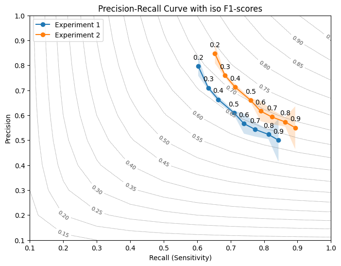

# Graphs

```python
from legow.graphs import ConfusionMatrixDetection
```

<div align="center">
    
</div>

```python
from legow.graphs import PrecisionRecallVisualizer

results_1 = {
    0.3: {"precision": [0.70, 0.72, 0.71], "recall": [0.65, 0.63, 0.62]},
    0.5: {"precision": [0.60, 0.62, 0.61], "recall": [0.70, 0.72, 0.71]},
    0.7: {"precision": [0.51, 0.58, 0.54], "recall": [0.79, 0.77, 0.76]},
    0.9: {"precision": [0.60, 0.51, 0.39], "recall": [0.86, 0.84, 0.83]},
}

results_2 = {
    0.3: {"precision": [0.75, 0.77, 0.76], "recall": [0.70, 0.68, 0.67]},
    0.5: {"precision": [0.65, 0.67, 0.66], "recall": [0.75, 0.77, 0.76]},
    0.7: {"precision": [0.56, 0.63, 0.59], "recall": [0.84, 0.82, 0.81]},
    0.9: {"precision": [0.65, 0.56, 0.44], "recall": [0.91, 0.89, 0.88]},
}

visualizer = PrecisionRecallVisualizer()
fig, ax = visualizer.visualize(results_1, label="Experiment 1")
fig, ax = visualizer.visualize(results_2, label="Experiment 2", fig=fig, axis=ax, )
plt.show()
```

<div align="center">
    
</div>
