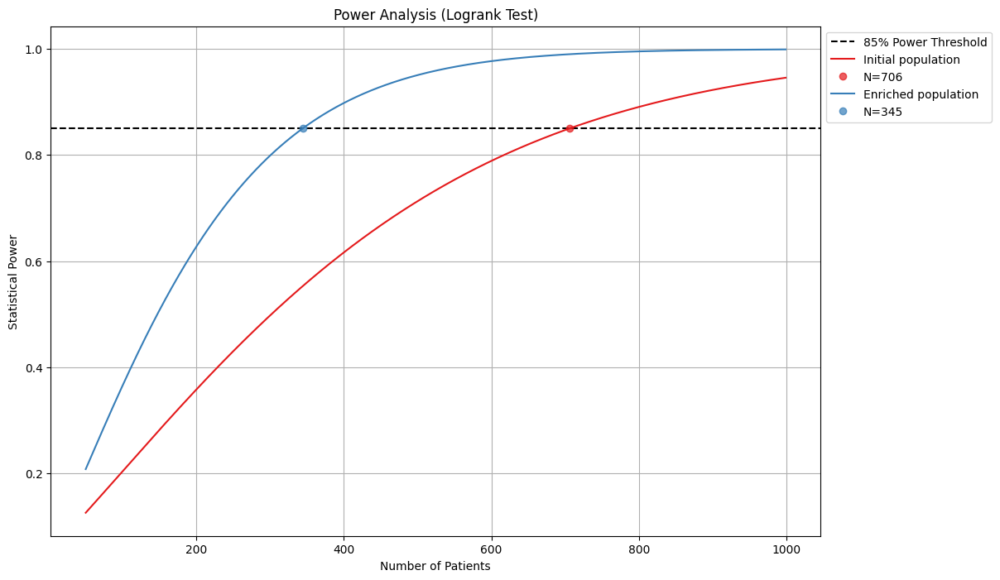
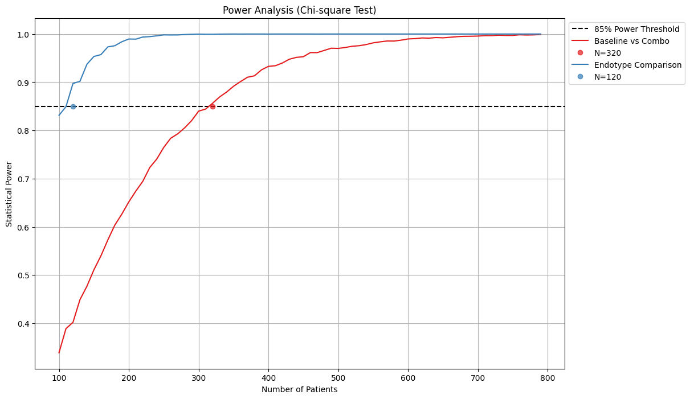

# Stats

```python
from legow.stats import PowerAnalysis
analysis = PowerAnalysis(alpha=0.05, power_threshold=0.85)

# Logrank example
hazard_ratios = [(0.7, "Initial population"), (0.6, "Enriched population")]
n_patients_range = np.arange(50, 1000, 1)
fig = analysis.plot_power_analysis(n_patients_range, hazard_ratios, test_type="logrank")
fig.show()
```

<div align="center">
    
</div>

```python
from legow.stats import PowerAnalysis
analysis = PowerAnalysis(alpha=0.05, power_threshold=0.85)

# Chi-square example
response_rates = [((0.239, 0.403), "Baseline vs Combo"), ((0.30, 0.60), "Endotype Comparison")]
n_patients_range = np.arange(100, 800, 10)
fig = analysis.plot_power_analysis(n_patients_range, response_rates, test_type="chi-square")
fig.show()
```

<div align="center">
    
</div>
