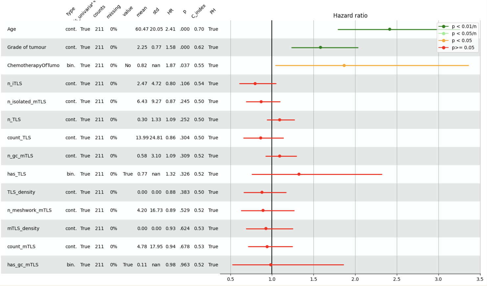

# Survival Analysis

```python
from legow.survival_analysis import SurvivalAnalysis

df = pd.DataFrame({
    'time': ...,
    'event': ...,
    'feature1': ...,
    'feature2': ...
})
sa = SurvivalAnalysis(df)
sa.plot_forest()
```

<div align="center">
    
</div>
